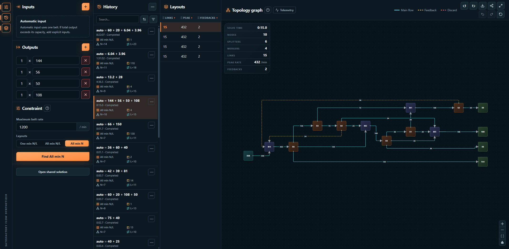

# Satisfactory Flow Synthetizer

[](LICENSE)
[](package.json)
[](#)
[](https://tauri.app)
[](https://www.rust-lang.org)
[](https://svelte.dev)

Offline Windows desktop app for exact Satisfactory splitter/merger flow synthesis. Set supply and demand, choose a result scope, and inspect, arrange or export validated belt layouts.



## Use

The Windows x64 installer and portable ZIP include cvc5 1.3.4 and its license notices. Install the app, or extract the entire portable ZIP and run `satisfactory-flow-synthetizer.exe`, keeping `cvc5.exe` beside it. No separate cvc5 installation is needed. The app solves offline. Microsoft Edge WebView2 is required; the installer can install that runtime if it is missing.

This build is unsigned, so Windows SmartScreen may warn on first run.

Enter rates as decimals or fractions and set the maximum belt rate. Automatic supply uses one belt; totals above capacity require explicit input belts. Every physical belt, including discard, has strictly positive flow within capacity.

| Result scope | Meaning                                                                   |
| ------------ | ------------------------------------------------------------------------- |
| One min N/L  | One exact layout after proving minimum nodes, then minimum operator belts |
| All min N/L  | Every distinct layout at those minimum N and L values                     |
| All min N    | Every distinct layout at minimum N across all feasible L values           |

N counts splitters and mergers. L counts operator-to-operator belts, excluding external stubs and discard belts. Equal optimal ties and delivery order can vary. All scopes support queuing and cancellation.

`best_known` is a validated incumbent. `proven_optimal` requires a completed objective proof. Enumeration completion is separate: cancelling keeps already delivered layouts and incomplete proofs remain incomplete. Finite impossibility proofs are distinct from timeouts, resource limits and failures.

History keeps requests, results, proofs and graph positions. Running work is checkpointed every five seconds and reloads as incomplete after interruption. Graph editing changes placement, not the validated connections.

## Developers

Requires current stable Rust, Node.js 20.19+ or 22.12+, PowerShell 7, Visual Studio C++ Build Tools and WebView2.

```powershell
npm ci
npm run dev
```

The first development build downloads and verifies the pinned cvc5 package. Solving itself is offline.

This branch also runs the shared interface in the browser. `npm run dev:web` prepares the local Wasm assets and starts it; `npm run build:web` produces the static browser build. All three exact scopes use independent local compute workers, hard cancellation and browser-local history. Automatic worker selection uses the client's reported logical processor count; lower counts are available to reduce memory use. Selected-solution links need no backend service. The first cvc5 Wasm build requires Linux x64 or Ubuntu WSL, Python and the `wasm32-unknown-unknown` Rust target. See the [browser development guide](docs/web-backends.md) for setup, architecture and tests.

The browser build includes independent compute workers and IndexedDB-backed paged result collections. It is not publicly deployed, and offline asset caching remains unfinished. The Windows release above remains an offline native application.

See the [development guide](docs/development.md) for checks and the code map, the [release guide](docs/release.md) for packaging, and the [benchmark guide](benchmarks/README.md) for performance work.

Use [Conventional Commits](https://www.conventionalcommits.org/) for focused commits and pull request titles. Do not commit machine-specific configuration, secrets or build artifacts.

## License

This project is licensed under the [MIT License](LICENSE).
